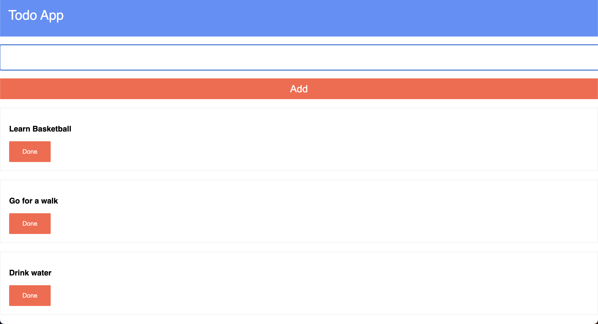

# Simple Todo App

Simple Todo App is a minimalist task management application that allows users to add and delete tasks easily. This app focuses on simplicity and efficiency, enabling users to maintain their to-do lists without any unnecessary complexity.

## Features

- **Add Tasks:** Quickly add new tasks to your to-do list.
- **Delete Tasks:** Remove completed or unwanted tasks with a single click.
- **User-Friendly Interface:** Intuitive design for a seamless user experience.
- **Lightweight:** The app is lightweight and fast, ensuring quick task management.

## Usage

1. **Add a Task:**
   - Click on the "+" button or the designated "Add Task" area.
   - Type the task you want to add and press Enter.

2. **Delete a Task:**
   - Hover over the task you want to delete.
   - Click on the delete (trash bin) icon to remove the task from your list.

## Installation

1. Clone the repository:
https://github.com/Jasleenkaur1998/Todo-App

2. Open `index.html` in your preferred web browser.

## Contributing

Contributions are welcome! Feel free to fork the repository, create a branch, and submit a pull request. Please make sure to follow the [code of conduct](CODE_OF_CONDUCT.md) and [contribution guidelines](CONTRIBUTING.md).

## Snapshots:

